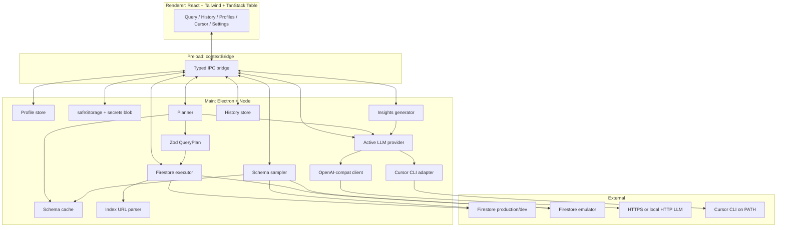

# Firestore Query Studio

**Local-first desktop app** for exploring [Google Cloud Firestore](https://firebase.google.com/docs/firestore) with **natural language**. You pick a Firebase project (or the local emulator), describe what you are looking for in plain English, and the app turns that into a structured query plan, runs it with the **Firebase Admin SDK**, and shows rows in a sortable, exportable table—with explanations, optional AI insights, and links to create missing composite indexes.

**Phase 1 is read-only:** no writes, no deletes, no seeding. The executor and IPC surface do not expose mutation APIs.

For the original product vision and phased roadmap, see [`firestore-nl-query.md`](./firestore-nl-query.md).

## Inspiration

This project draws inspiration from **[Query Studio (db-lang)](https://github.com/iamEtornam/db-lang)** by [iamEtornam](https://github.com/iamEtornam) — a native, **AI-driven database tool that bridges natural language and SQL** across PostgreSQL, MySQL, SQLite, and MSSQL. **Firestore Query Studio** applies a similar *describe what you want → structured query → results table* workflow to **Google Cloud Firestore**, with a Zod-validated plan DSL, Firebase Admin SDK / emulator support, and a read-only Phase 1 scope.

---

## Table of contents

- [Inspiration](#inspiration)
- [Why use this](#why-use-this)
- [Features](#features)
- [Tech stack](#tech-stack)
- [Prerequisites](#prerequisites)
- [Quick start](#quick-start)
- [Scripts reference](#scripts-reference)
- [Profiles: emulator vs live](#profiles-emulator-vs-live)
- [LLM configuration](#llm-configuration)
- [Using the app](#using-the-app)
- [Query plans: query, scan, and multi](#query-plans-query-scan-and-multi)
- [Architecture](#architecture)
- [Project layout](#project-layout)
- [Security & privacy](#security--privacy)
- [Troubleshooting](#troubleshooting)
- [Roadmap](#roadmap)
- [Contributing](#contributing)
- [License](#license)

---

## Why use this

- **You stay in control:** data stays on your machine; credentials use the OS keychain where possible.
- **No “run arbitrary code from the LLM”:** the model outputs JSON that must validate against a **Zod `QueryPlan` schema** before anything touches Firestore.
- **Honest about cost:** bounded scans, caps, and warnings when results are truncated.
- **Works offline from the cloud LLM vendor** if you use a **local** OpenAI-compatible server (e.g. Ollama) or the **Cursor CLI** agent—subject to your own networking.

---

## Features


| Area                        | What you get                                                                                                                                                                                                           |
| --------------------------- | ---------------------------------------------------------------------------------------------------------------------------------------------------------------------------------------------------------------------- |
| **Connections**             | **Live** projects via service-account JSON (path only, never copied into profile blobs) or **Firestore emulator** (host/port).                                                                                         |
| **Environment awareness**   | Profiles carry a **dev / staging / prod** tag shown in the header so you always know what you are pointed at.                                                                                                          |
| **Natural language → plan** | LLM proposes a `**QueryPlan`**: collection, filters, order, limits, optional scan or multi-step flow.                                                                                                                  |
| **Two planner backends**    | **OpenAI-compatible HTTP** (`/chat/completions`) or **Cursor CLI** (`cursor-agent` and friends)—selectable as the active **provider**.                                                                                 |
| **Schema grounding**        | Samples up to **N** documents per collection (configurable `sampleSize`), infers field names/types, caches results; you can **override** schema text per collection.                                                   |
| **Execution**               | Main process runs **Admin SDK** queries; enforces **scan caps**; maps `**FAILED_PRECONDITION`** to a **“Create composite index”** link when the console URL is present.                                                |
| **Results**                 | **TanStack Table**: sort, virtualized rows, JSON/CSV export, copy document paths, warnings for truncated scans.                                                                                                        |
| **Explain & insights**      | **Explain** tab: plan JSON, rationale, pseudo Firestore SDK code. **Insights** tab: optional LLM summary of the result set (same provider rules as planning).                                                          |
| **History**                 | Per-profile **query history** (question, collection, plan snapshot, outcome); reopen a run into the Query tab.                                                                                                         |
| **Settings**                | OpenAI-compatible **base URL**, **model**, **API key**, **request timeout**, **warm-up** (local servers).                                                                                                              |
| **Cursor**                  | **Cursor CLI** command, model, mode, timeout, env, tests—and the **toggle** that selects **OpenAI-compatible** vs **Cursor CLI** as the active planner backend.                                                        |
| **Desktop shell**           | **Electron** + **Vite**; renderer uses **strict CSP** (see `[src/renderer/index.html](./src/renderer/index.html)`); sensitive values use `**safeStorage`** with a documented plain-file fallback on some Linux setups. |


---

## Tech stack

- **Electron** (main + preload + renderer), **electron-vite**, **TypeScript**
- **React 19**, **Tailwind CSS**, **lucide-react**
- **Firebase Admin SDK** for Firestore
- **Zod** for shared types, IPC payloads, and `QueryPlan` validation
- **TanStack Table** + **TanStack Virtual** for the results grid
- **Vitest** for unit tests; **Firebase emulator** for optional integration tests

---

## Prerequisites


| Requirement               | Notes                                                                                                                                                                |
| ------------------------- | -------------------------------------------------------------------------------------------------------------------------------------------------------------------- |
| **Node.js 20+**           | Matches `engines` in `package.json`.                                                                                                                                 |
| **pnpm**                  | `corepack enable && corepack prepare pnpm@latest --activate` or `npm i -g pnpm`.                                                                                     |
| **Java 11+**              | Only if you run `**pnpm test:emulator`** or start the Firestore emulator yourself.                                                                                   |
| **Firebase CLI**          | Only for `**pnpm test:emulator`** or local emulator workflows: `npm i -g firebase-tools`.                                                                            |
| **Cursor CLI (optional)** | If you use the **Cursor CLI** provider, install the Cursor CLI / `cursor-agent` per [Cursor’s docs](https://cursor.com/docs) and configure it on the **Cursor** tab. |


**Native modules:** `electron` and `keytar` may compile on install. This repo uses `pnpm.onlyBuiltDependencies` so installs stay non-interactive where possible.

---

## Quick start

```bash
git clone https://github.com/<org-or-user>/firestore-query-studio.git
cd firestore-query-studio
pnpm install
pnpm dev
```

`pnpm dev` runs **electron-vite dev**: Electron opens, the renderer is served with HMR (default Vite port, often `5173`), and main/preload rebuild on change.

1. Open **Profiles** → create an **Emulator** or **Live** profile → **Set active**.
2. Open **Settings** (OpenAI-compatible provider) or **Cursor** (CLI provider) → configure and save.
3. Open **Query** → optional collection → natural language question → **Build plan** → **Run** (or enable auto-run).

---

## Scripts reference


| Script               | Purpose                                                                                       |
| -------------------- | --------------------------------------------------------------------------------------------- |
| `pnpm dev`           | Development: Electron + Vite HMR.                                                             |
| `pnpm build`         | Production bundle → `out/main`, `out/preload`, `out/renderer`.                                |
| `pnpm start`         | `electron-vite preview` (preview production build).                                           |
| `pnpm test`          | Unit tests (no emulator, no network).                                                         |
| `pnpm test:watch`    | Vitest watch mode.                                                                            |
| `pnpm test:emulator` | Integration tests via `firebase emulators:exec --only firestore` (needs Java + Firebase CLI). |
| `pnpm typecheck`     | `tsc --noEmit` for Node (main/preload) and web (renderer) projects.                           |
| `pnpm lint`          | ESLint on `ts` / `tsx`.                                                                       |
| `pnpm format`        | Prettier write for `src` and `tests`.                                                         |


---

## Profiles: emulator vs live

### Emulator (recommended for learning)

1. In another terminal: `firebase emulators:start --only firestore` (from this repo root so `[firebase.json](./firebase.json)` applies).
2. **Profiles** → **New profile** → **Emulator** → set **Project ID** (any string is fine for local), **Host** `127.0.0.1`, **Port** `8080` (defaults in `firebase.json`).
3. **Set active**. The banner reflects your **env** tag (e.g. dev).

### Live (Admin SDK)

1. In Google Cloud / Firebase, create a **service account** with Firestore **read** access (e.g. **Cloud Datastore User** or a tighter custom role).
2. Download the **JSON key** and store it somewhere on disk. The app stores **only the path** in the profile.
3. **Profiles** → **New profile** → **Live** → **Project ID** must match the JSON’s `project_id` → paste the **absolute path** to the JSON.
4. **Set active**. Use **prod** env tag for production projects so the UI shows a strong warning color.

> **Admin SDK bypasses Firestore security rules.** Treat this like any admin tool: prefer emulator or a dedicated dev project.

### Profile limits

- `**scanCap`** (default 500, max 50_000): hard ceiling for bounded **scan** mode (client-side filtering after fetching docs).
- `**sampleSize`** (default 10, max 200): how many documents to read when inferring schema for a collection.

---

## LLM configuration

The app stores an **active provider** (`openai-compat` | `cursor-cli`) alongside secrets (see `[src/main/profiles/secrets.ts](./src/main/profiles/secrets.ts)`).

### OpenAI-compatible (HTTP)

**Settings** tab:

- **Base URL** — e.g. `https://api.openai.com/v1` or `http://127.0.0.1:11434/v1` (Ollama). The client appends `/chat/completions`.
- **Model** — e.g. `gpt-4o-mini`, or a local model name.
- **API key** — optional for some local servers; required for most cloud APIs. Stored with `**safeStorage`** when the OS supports it.
- **Request timeout** — default 30s; **raise** for slow local models (60–300s is common). When timeout ≥ 60s, the HTTP client uses **fewer retries** so a bad run does not multiply wait time.
- **Warm up model** — sends a tiny completion to reduce **cold start** latency on Ollama / LM Studio. After **Save**, a silent warm-up runs if the base URL looks **local**.

`response_format: json_object` is requested where the endpoint supports it, and the planner extracts the first complete top-level JSON object from the reply (handles fences and trailing prose).

### Cursor CLI

**Cursor** tab:

- Configure `**cursor-agent`** (or your wrapper), **model**, **mode** (`default` | `plan` | `ask`), optional **cwd**, **extra args**, **environment** key/value lines, and **timeout** (default 60s).
- Use **Test** / **List models** to verify the binary is on `PATH` and responding.
- After a successful **Test** and **Save**, enable **Use Cursor CLI as the planner backend** so planning and insights use the CLI.

When **Cursor CLI** is the active provider, **plan** and **insights** calls go through the CLI instead of the HTTP LLM client. Keep **Settings** filled if you switch back to OpenAI-compatible mode.

---

## Using the app

### Tabs (all stay mounted)

Switching tabs does **not** unmount panels: in-flight **Build plan** / **Run** work and your draft question **persist** while you peek at Settings or Profiles.


| Tab          | Role                                                                                              |
| ------------ | ------------------------------------------------------------------------------------------------- |
| **Query**    | NL question, collection picker, plan + run, results, Explain / Insights / Schema.                 |
| **History**  | Per-profile history; reopen entries into Query.                                                   |
| **Profiles** | CRUD profiles, active profile, env tag, caps, help links for Project ID / service account JSON.   |
| **Cursor**   | Cursor CLI configuration, model listing, smoke test, and **switch active provider** (HTTP ↔ CLI). |
| **Settings** | OpenAI-compatible HTTP LLM fields (used when the active provider is not Cursor CLI).              |


### Typical flow

1. **Sample schema** (implicit when you use a collection): first time, the app may sample documents so the LLM sees real field names.
2. **Build plan** — validates JSON → `**QueryPlan`** via Zod.
3. **Run** — executor talks to Firestore; errors with index URLs surface a button to the Firebase console.
4. **Insights** (optional) — second LLM pass over a compact summary of rows (bounded input); uses the same **active provider**.

---

## Query plans: query, scan, and multi

- `**query`** — Normal Firestore `collection().where().orderBy().limit()` style execution when inequalities and indexes line up.
- `**scan**` — For patterns Firestore cannot express (e.g. some substring / case-folding / richer post-filters), the executor may read up to `**min(plan.scanCap, profile.scanCap)**` documents and apply `**postFilters**` in Node. UI shows **warnings** when caps truncate work.
- `**multi`** — Multiple steps (e.g. resolve an ID then query another collection); executor runs steps, merges rows, and reports per-step stats.

The LLM is instructed with Firestore constraints (single inequality field per query, index needs, optional collection group semantics) in `[src/main/llm/prompts/queryPlanSystem.ts](./src/main/llm/prompts/queryPlanSystem.ts)`.

---

## Architecture




**IPC:** every channel is declared in `[src/shared/ipc-api.ts](./src/shared/ipc-api.ts)` with **Zod** request/response shapes. The main router validates before executing (`[src/main/ipc/router.ts](./src/main/ipc/router.ts)`).

---

## Project layout


| Path                                | Responsibility                                                                 |
| ----------------------------------- | ------------------------------------------------------------------------------ |
| `src/shared/types/plan.ts`          | `QueryPlan` Zod schema — contract between planner and executor.                |
| `src/shared/types/profile.ts`       | Profiles, `LlmSettings`, `CursorSettings`, `LlmProvider`.                      |
| `src/shared/types/schema.ts`        | `CollectionSchema` inference + overrides.                                      |
| `src/shared/types/results.ts`       | `RunOutcome`, stats, warnings, index hints.                                    |
| `src/shared/types/history.ts`       | History entry / summary types.                                                 |
| `src/shared/types/ipc.ts`           | Channel names + payload schemas.                                               |
| `src/shared/ipc-api.ts`             | Maps channels → Zod in/out for compile-time safety.                            |
| `src/main/index.ts`                 | Electron app entry, window, IPC registration.                                  |
| `src/main/ipc/router.ts`            | IPC handlers.                                                                  |
| `src/main/profiles/profileStore.ts` | Profile JSON on disk (no secrets).                                             |
| `src/main/profiles/secrets.ts`      | Encrypted blob: LLM settings, provider, Cursor settings.                       |
| `src/main/firestore/*`              | Admin client, connection manager, executor, sampler, cache, index parser.      |
| `src/main/llm/openaiCompat.ts`      | BYOK HTTP client (timeout, retries).                                           |
| `src/main/llm/cursorCli.ts`         | Cursor CLI subprocess / streaming adapter.                                     |
| `src/main/llm/planner.ts`           | Prompt + provider branch + JSON extraction + validation.                       |
| `src/main/llm/insights.ts`          | Post-query insights prompt path.                                               |
| `src/main/history/historyStore.ts`  | Per-profile history persistence.                                               |
| `src/preload/index.ts`              | `contextBridge` API surface.                                                   |
| `src/renderer/app/*`                | Pages and panels (`QueryPage`, `HistoryPage`, `ResultsTable`, …).              |
| `src/renderer/state/AppState.tsx`   | Global React context for profiles, secrets handles, provider, history handoff. |
| `tests/unit/*`                      | Fast unit tests.                                                               |
| `tests/integration/*`               | Emulator-backed tests (`vitest.emulator.config.ts`).                           |


---

## Security & privacy

- **No telemetry** is wired in this repository; you control your LLM endpoint and Firebase project.
- **Service-account JSON** is read from disk at runtime using the path you configure; it is not uploaded to a third party by this app (only **your chosen LLM host** receives prompts, and **Google’s Firestore API** receives queries).
- **LLM prompts** contain your natural language question and, when available, a **schema snapshot** derived from sampled documents—avoid pasting secrets into the question box.
- **CSP** in the renderer restricts script and connect defaults; LLM and Firestore traffic originate from the **main process** (`fetch` / Admin SDK), not from the renderer’s origin.
- **Read-only MVP** reduces risk: there is no write path to misconfigure in Phase 1.

Report security issues responsibly — see [`SECURITY.md`](./SECURITY.md) for the private disclosure channel. Please do **not** open public GitHub issues for exploitable bugs.

---

## Troubleshooting


| Symptom                          | Things to check                                                                                           |
| -------------------------------- | --------------------------------------------------------------------------------------------------------- |
| `**pnpm test:emulator` fails**   | Java on `PATH`, `firebase` CLI installed, port 8080 free.                                                 |
| **Plan timeouts with local LLM** | Increase **timeout** in Settings; use **Warm up model**; prefer a smaller model or GPU offload.           |
| `**LLM_NOT_CONFIGURED`**         | Open **Settings**, save base URL + key (HTTP mode), or switch provider / configure **Cursor** tab.        |
| `**CURSOR_NOT_CONFIGURED`**      | Select Cursor provider only after saving Cursor tab settings.                                             |
| **Composite index errors**       | Use the in-app link to open the Firebase console index builder.                                           |
| **Linux keychain / keytar**      | May need platform packages for secret storage; app falls back to a chmod `0600` file and logs a warning.  |
| **CSP console noise**            | Rare; renderer CSP is in `src/renderer/index.html`. Main-process `fetch` is not subject to that meta tag. |


---

## Roadmap

High level (see also `firestore-nl-query.md`):

- **Phase 2** — explicit write mode, allowlists, safer mutations, seed data workflows.
- **Phase 3** — Firebase Storage exploration.
- **Packaging** — signed installers, auto-update, crash reporting (none in-tree today).
- **Optional integrations** — deeper Cursor / agent workflows.

---

## Contributing

Contributions are welcome: bug reports, docs, tests, and focused PRs. See [`CONTRIBUTING.md`](./CONTRIBUTING.md) for the full guide.

Quick version:

1. **Fork** the repository and create a branch from `main`.
2. `pnpm install` → `pnpm typecheck` → `pnpm test` before opening a PR.
3. If you change IPC or shared Zod schemas, update **both** main and preload/renderer clients and add/adjust tests.
4. Keep PRs **small and descriptive**; match existing formatting (`pnpm format`).
5. PRs run CI automatically (`.github/workflows/ci.yml`): typecheck + unit tests. `main` is protected and needs a review before merging.

**Security:** do not file exploitable issues as public GitHub issues — see [`SECURITY.md`](./SECURITY.md) for the private disclosure channel.

---

## License

This project is licensed under the **MIT License** — see `[LICENSE](./LICENSE)`.

`package.json` declares `"license": "MIT"`. The package remains `"private": true` so it is not accidentally published to npm; remove that field when (and if) you publish the app as a package.

---

**Disclaimer:** *Firestore Query Studio is not affiliated with Google LLC. Firebase and Firestore are trademarks of Google LLC.*